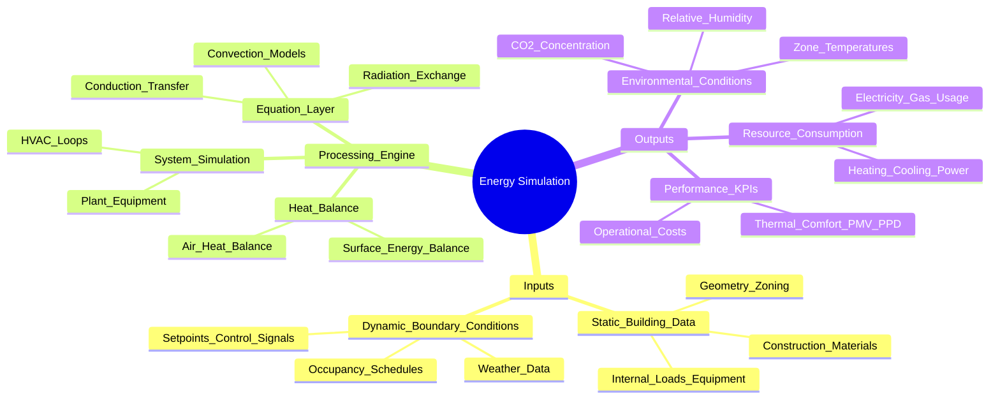
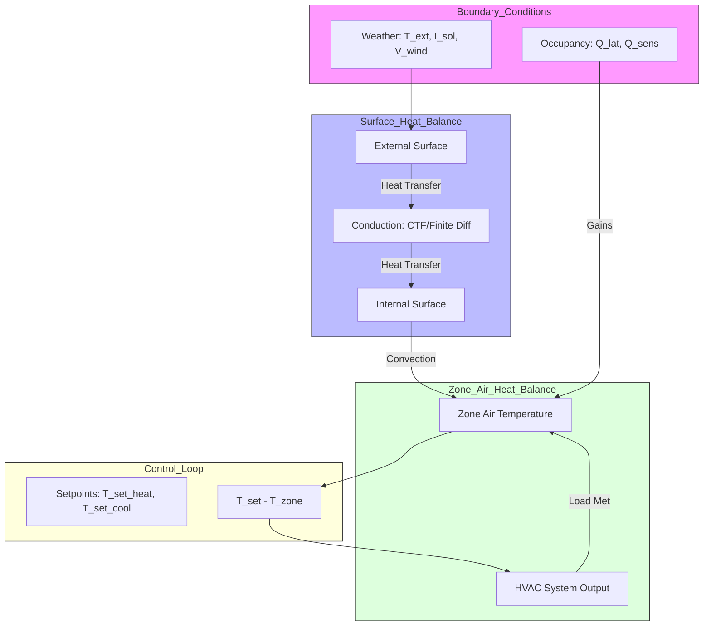

# Energy Simulation Process Scheme

This document maps out the flow of data and physical logic within a building energy simulation, specifically referencing variables found in EnergyPlus (IDF) and Boptest environments.

## Process Flow Mindmap

## Detailed Variable Mapping

### 1. General Input Needs
Based on the `Model_Thesis_MPC_Optimized.idf` and common requirements:
- **Geometry & Construction**: Floor area, wall orientations, U-values (thermal transmittance), thermal mass (capacitance).
- **Control Variables** (`inputs.json`):
    - `con_oveTSetCoo_u`: Cooling setpoint [K].
    - `con_oveTSetHea_u`: Heating setpoint [K].
    - `fcu_oveFan_u`: Fan control signal [0-1].
    - `fcu_oveTSup_u`: Supply air temperature setpoint [K].

### 2. Boundary Conditions (Weather/Schedules)
Inputs that drive the simulation over time:
- **Weather** (`measurements.json`): 
    - `zon_weaSta_reaWeaTDryBul_y`: Outside drybulb temperature [K].
    - `zon_weaSta_reaWeaHGloHor_y`: Global horizontal solar irradiation [W/m²].
    - `zon_weaSta_reaWeaWinSpe_y`: Wind speed [m/s].
- **Schedules**: `Office Occ`, `Heating_Schedule`, `Cooling_Schedule` (found in IDF).

### 3. Processing & Physical Equations
The "Black Box" where inputs are transformed into outputs.
- **Surface Heat Balance**: $q'' + \sum q_{conv} + \sum q_{rad} = 0$.
- **Zone Air Balance**: $\rho c_p V \frac{dT_{zone}}{dt} = \sum Q_{surface} + \sum Q_{internal} + \sum Q_{hvac}$.

> [!TIP]
> **Messaging Suggestion**: To avoid "messy" diagrams, keep the high-level mindmap focused on *variables* and create a sub-section or a secondary flowchart (as shown below) for the *equations*. This separates the "What" (data) from the "How" (physics).

### 4. Output Variables
What we measure to evaluate performance (`measurements.json`):
- **Thermal State**: `zon_reaTRooAir_y` (Zone Air Temp).
- **Indoor Air Quality**: `zon_reaCO2RooAir_y`.
- **Power Usage**: `fcu_reaPCoo_y` (Cooling Power), `fcu_reaPHea_y` (Heating Power), `fcu_reaPFan_y` (Fan Power).

## Physics Layer Flowchart

While the Mindmap shows the **data hierarchy**, the flowchart below illustrates the **physical causality** (the "How").

## Governing Physical Equations

To understand where variables are needed, we look at the core conservation loops.

### 1. Zone Air Heat Balance
Governs the change in zone temperature over time. 

**LaTeX Version:**
$$ \rho_{air} C_{p, air} V_z \frac{dT_z}{dt} = \sum_{i=1}^{n_{surfaces}} \dot{Q}_{conv, i} + \dot{Q}_{inf} + \dot{Q}_{sys} + \dot{Q}_{int} $$

**Text Version:**
`ρ * Cp * V * (dT/dt) = sum(Q_conv) + Q_inf + Q_hvac + Q_internal`

*Variables:*
- $T_z$: Zone Air Temperature (Output measurement: `zon_reaTRooAir_y`)
- $\dot{Q}_{sys}$: HVAC Power (Input control: `fcu_oveTSup_u`, output: `fcu_reaPHea_y`)

### 2. Surface Heat Balance
Governs the conduction through walls and radiation on surfaces.

**LaTeX Version:**
$$ q''_{conv} + q''_{LW} + q''_{SW} + q''_{cond} = 0 $$

**Text Version:**
`q_convection + q_longwave + q_shortwave + q_conduction = 0`

*Variables:*
- $q''_{SW}$: Solar Radiation (Weather input: `zon_weaSta_reaWeaHGloHor_y`)
- $q''_{cond}$: Conduction (Static inputs: Material Conductivity, Thickness)

### 3. HVAC System Logic (Boptest Focus)
In Boptest, the system often uses normalized control signals.

**LaTeX Version:**
$$ \dot{Q}_{hvac} = \dot{m}_{air} C_p (T_{sup} - T_{zone}) $$

**Text Version:**
`Q_hvac = m_dot_air * Cp * (T_supply - T_zone)`

*Variables:*
- $\dot{m}_{air}$: Air mass flow (Input: `fcu_oveFan_u`, Output: `fcu_reaFloSup_y`)
- $T_{sup}$: Supply air temperature (Input: `fcu_oveTSup_u`)

## Suggestion for Equation Integration
> [!NOTE]
> **Separation of Concerns**: By keeping the mindmap for **Data Architecture** and the flowchart for **Physics Logic**, you avoid the "messy" overlap. 
> 
> - Use the **Mindmap** to talk to Data Engineers/Software Developers.
> - Use the **Physics Flowchart** to talk to Mechanical Engineers/Control Theorists.
> - Use the **Equations Section** for the implementation of the MPC (Model Predictive Control) logic.
