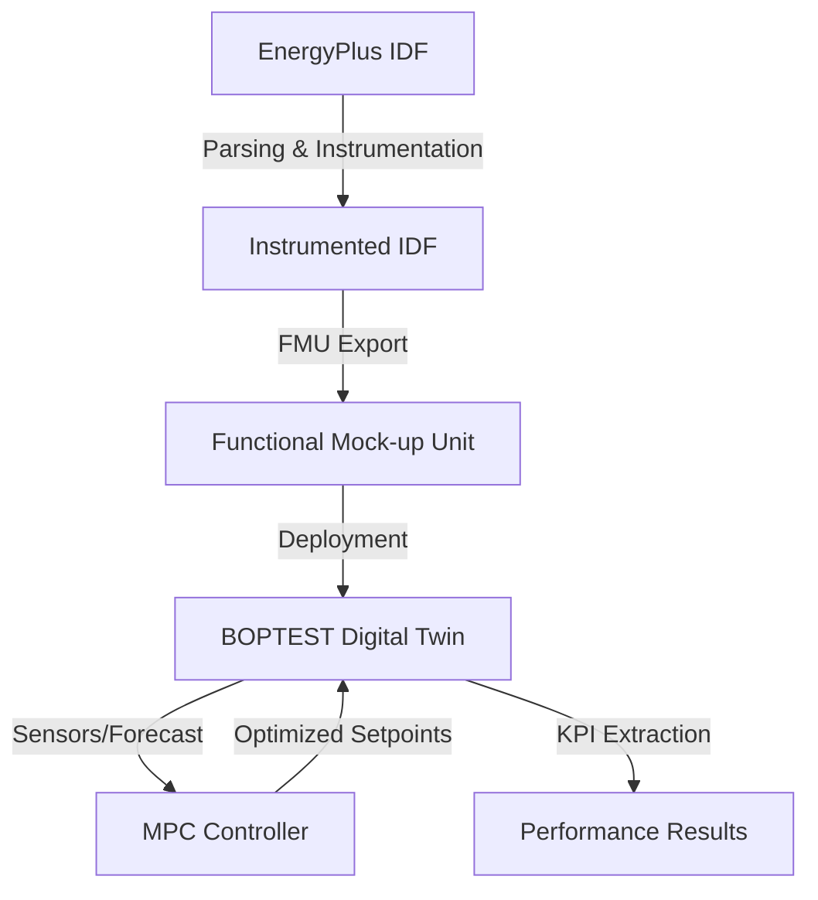

# Building Energy Modeling & MPC Optimization Workflow

This document explains the technical pipeline developed to automate the generation, calibration, and optimization of building energy models using EnergyPlus, FMUs, and the BOPTEST framework.

## Workflow Overview

The pipeline follows a structured path from static building definitions to dynamic, optimized control.

---

## 1. The EnergyPlus IDF (The Foundation)
The **Input Data File (IDF)** is the core definition of the building's physical properties.
- **Static Definition**: Geometry (zones, surfaces), constructions (U-values, thermal mass), and internal gains (occupancy, lighting).
- **Automated Parsing**: We use `src/archetype/parse_archetype.py` to convert the text-based IDF into a structured `archetype_params.json`.
- **Instrumentation (Cutting the Wires)**: To allow external control, the `src/archetype/idf_instrumenter.py` script injects `ExternalInterface` objects. This replaces internal schedules with "hooks" that can be manipulated by our algorithms.

## 2. Functional Mock-up Unit (FMU) (The Bridge)
EnergyPlus models are compiled into **FMUs (Functional Mock-up Units)** to enable standardized co-simulation.
- **Standardization**: The FMU follows the FMI standard, making the complex EnergyPlus engine look like a standardized "black box" with inputs and outputs.
- **Encapsulation**: It packages the building logic, weather data, and thermal physics into a portable file (`.fmu`) that can be executed in any compatible environment.

## 3. The Role of BOPTEST (The Digital Twin)
**BOPTEST (Building Optimization Testing Framework)** acts as our virtual testing ground.
- **Server Deployment**: The FMU is wrapped in a Docker-based REST API.
- **Scenario Management**: It manages simulation time, selects weather scenarios (e.g., "typical_heat_day"), and provides high-fidelity forecasts.
- **KPI Benchmarking**: It automatically calculates standard KPIs like Energy Consumption [kWh], Thermal Discomfort [Kh], and Carbon Emissions.

## 4. Parameter Extraction & Control (The Intelligence)
The pipeline uses two main control strategies:
1. **Rule-Based Control (RBC)**: The "Baseline" represented by traditional thermostat logic.
2. **Model Predictive Control (MPC)**:
   - Uses an **Identified RC Model** (Resistor-Capacitor network) to represent building physics.
   - **Optimization**: Solves an objective function (Energy vs. Comfort) over a future horizon (e.g., 24 hours).
   - **Feedback**: Receives current states from Boptest and sends back the optimal heating/cooling setpoints.

## 5. Comparison Results & Analysis
Success is measured by comparing the **Baseline (RBC)** vs. the **MPC**.
- **The Pareto Frontier**: We analyze the trade-off between energy savings and user comfort by varying objective weights ($\alpha$ vs. $\beta$).
- **Verification**: The `phd_pipeline_orchestrator.py` automates the entire loop, ensuring that results are reproducible across different regions (Chicago, Denver, Copenhagen).

---

## 6. Future Applications

The robustness of this pipeline enables several advanced research and commercial paths:

### 🌏 Large-Scale Urban Modeling
- **Archetype Scaling**: Rapidly generate "Naive" IDFs for entire neighborhoods based on urban building archaeological data.
- **District Energy Systems**: Optimizing interaction between multiple buildings and a shared thermal grid.

### ⚡ Grid-Interactive Efficient Buildings (GEB)
- **Demand Response**: Using building thermal mass as a "battery" to shift loads when the electrical grid is stressed.
- **Carbon Tracking**: Direct integration with real-time grid emissions factors to minimize the building's carbon footprint.

### 🤖 Autonomous Commissioning
- **Diagnostic Twins**: Comparing real building data against the FMU "Digital Twin" to detect HVAC faults or degradation.
- **Self-Tuning Controllers**: MPC systems that automatically refine their internal physics models as they collect more data.

---
> [!IMPORTANT]
> This pipeline reduces the manual effort of building energy modeling by over 80%, allowing researchers to focus on **Control Policy Design** rather than file formatting.
